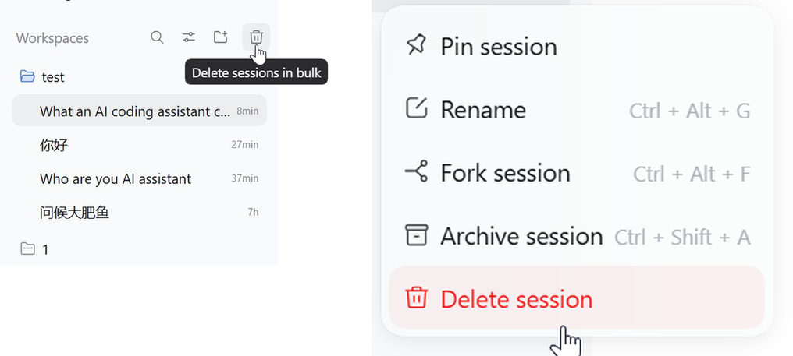
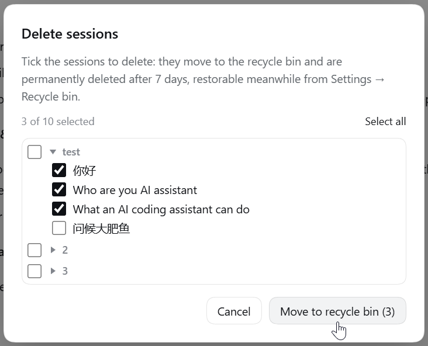
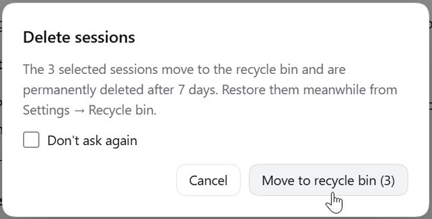
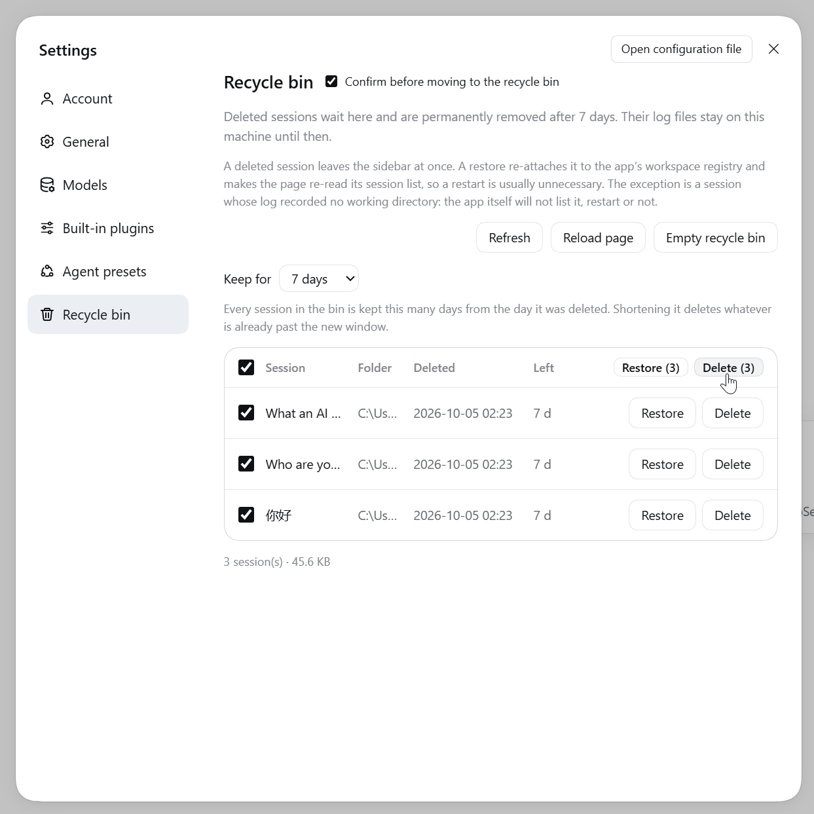
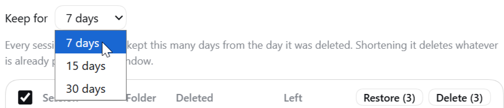

# Delete Session & Recycle Bin

**A real “Delete session” for the DeepSeek Harness desktop app.**

Out of the box a session's row menu offers **Pin / Rename / Fork / Archive** — and archiving only files a session away into the archive list, it is still there. This plugin adds delete: the session moves into a **recycle bin** that keeps it for **15 days** by default (7 / 15 / 30, changeable in Settings), restorable at any time from **Settings → Recycle bin**. The files are only really removed on expiry, or when you press **Delete** / **Empty recycle bin**. Several sessions at once go through the **bulk delete** button above the sidebar's workspace list.

[中文说明 →](README.zh.md)

## Screenshots

**Delete session** is appended to the row's `…` menu — the hover trash button on the row is the same action — and to delete several at once there is a trash button above the workspace list. The two ways in, side by side — **left** the bulk button, **right** the row menu with **Delete session** in red at the end:



The bulk button opens a picker holding every session:



Either way it asks for confirmation first; tick “Don't ask again” and later deletions go straight to the bin, with a switch in Settings to bring the question back:



**Settings → Recycle bin** shows the bin as a table: Session | Folder | Deleted | Left | [Restore] | [Delete], plus [Empty recycle bin]. Tick the sessions you want and the restore/delete buttons appear in the table's own header row, so a batch acts on exactly what is ticked:



The **Keep for** period is one number for the whole bin, 15 days by default, and shortening it asks first because entries already past the new window are deleted on the spot:



## Features

- **Deleting is reversible**: a delete is a move — the session log and that name's cache travel into the bin, and a restore puts them back file by file, title and working directory included.
- **The row leaves the sidebar immediately**, with no app restart, and no empty group appears at the bottom.
- **Deleting the session you are looking at** hands the main view to a fresh session in the same workspace instead of leaving you on one that no longer exists.
- **Three entry points**: the row menu, the hover button, and the bulk button above the workspace list. All of them ask the same question, and the question can be switched off and back on in Settings.
- **Batch works end to end**: delete as many sessions as you like in one go, and the bin restores or deletes them in bulk from the table header.
- **Chinese and English**, following the app's language.
- **The toasts do not lie**: only when the app really has the row back does a restore say “it is back in the list”; otherwise it says honestly that it returns after a restart.

## Install

Requires the **DeepSeek Harness desktop app** (`desktop` profile). Developed and verified against **0.2.0-rc.2** (Electron 44, Windows); other versions are untested.

### Ask an agent to install it

Just tell the agent inside DSH:

> Install this plugin for me: `github:cckbc/dsh-session-recycle-bin`

It installs through the plugin-manager tool, and asks you for approval when it lacks the permission.

### From the Plugins page

1. Open **Plugins** in the DSH sidebar and choose **Add plugin**;
2. Enter the Git address `github:cckbc/dsh-session-recycle-bin` for the source;
3. Press **Install**, then **Enable now** (a freshly installed bundle stays switched off) — then **quit the app completely and reopen it**.

### From the command line (CLI / Web profiles)

```sh
dsh plugin --profile web add github:cckbc/dsh-session-recycle-bin
# pinning a version is safer: dsh plugin --profile web add github:cckbc/dsh-session-recycle-bin#<commit-sha>
```

The desktop profile cannot be managed this way — the app owns it — so use the Plugins page above.

### From a local directory

```sh
git clone https://github.com/cckbc/dsh-session-recycle-bin.git
```

Clone it wherever you like (pick a directory you will keep), then **Plugins** → **Add plugin** → enter the **absolute path of that directory**.

> **Keep that directory in place.** A local-path install is a `link:` dependency: the profile's `node_modules/@cckbc/dsh-session-recycle-bin` points at it, so moving or deleting the directory breaks the plugin.

### Upgrading and uninstalling

The app's own notice: **plugins have no automatic update — to upgrade, uninstall first and then install the new version**. The local-directory route is the exception: `git pull`, then reopen the app.

**Uninstalling**: disable/remove it on the Plugins page; whatever is still in the recycle bin lives in `<DSH_HOME>/dsh-trash/` and is not removed for you.

## Problems and limits

- **This is not a feature the app ships — it is grafted onto the app**: there is no “delete session” in the app, and no delete API for plugins. Removing a row, and putting it back, means editing things the app keeps internally: which workspace a session belongs to, the sidebar's session list, the settings page's navigation. DeepSeek has published none of that and promises none of it stays the same, so a Harness update can break the plugin — worst case a delete or restore errors out or does nothing (the session logs stay on disk).
- **“Delete” and “Empty recycle bin” really delete**: no OS recycle bin, no undo. Back up anything you care about first.
- **No cascade cleanup**: a session's attachments (`<DSH_HOME>/attachments`), AgentTeams working directories and similar derived data are outside the bin.
- **One class of session is the exception**: a cold session whose log never recorded a working directory is skipped by the app's own list, so a restart will not show it either — the toast says so honestly.
- **A restore does not bring back pinned/archived state**; the retention period is 15 days by default and can be set to 7 / 15 / 30 days in **Settings → Recycle bin**. It is one number for the whole bin: every entry expires that long after its own deletion time, and shortening it asks first, because entries already past the new window are deleted on the spot.
- **The list the running app keeps in memory is only rebuilt at the next launch**: the sidebar row is governed by the plugin's own hidden list and `workspace.json` on disk is already updated, but the running app still remembers the old state.
- **Verified on Windows + 0.2.0-rc.2 only**: macOS/Linux and other Harness versions are untested.
- **A duplicated id is moved from the first match only**: the delete walks `<DSH_HOME>/sessions/` for the workspace directory that holds this id and takes the first hit; if the same id somehow exists under two workspaces (a hand-copied directory, say), the second one is left untouched. The id is dropped from every workspace's account so no phantom row appears after a restart.

## License

[MIT](LICENSE).
