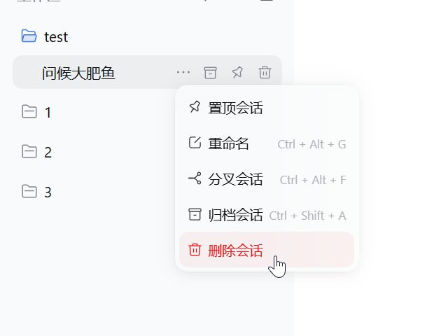
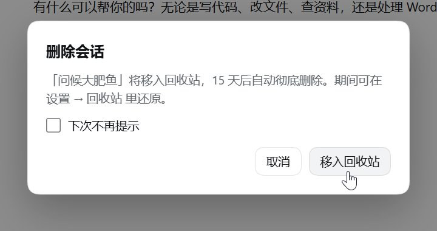
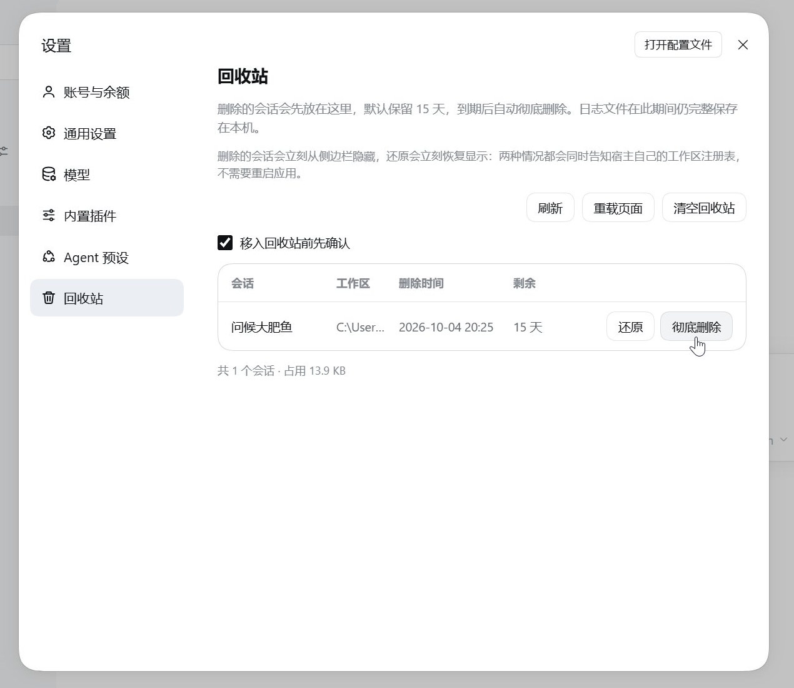

# 会话删除与回收站

**给 DeepSeek Harness 桌面端补一个真正的「删除会话」。**

应用自带的会话动作只有 **置顶／重命名／分叉／归档**——归档只是把会话收进归档列表，它还在。这个插件补上删除：确认后把会话移入**回收站**，默认保留 **15 天**，期间随时能在 **设置 → 回收站** 里还原；到期了，或者你点「彻底删除」「清空回收站」，才真的从磁盘上删掉。

删除是删除，归档是归档：插件不碰归档列表，也不改任何会话的置顶/归档状态。

[English →](README.md)

## 界面

会话行的 `…` 菜单末尾多一项「删除会话」，行内悬停的垃圾桶按钮是同一个动作：



点它弹确认框；勾上「下次不再提示」以后就直接进回收站，想改回来在设置页里勾：



**设置 → 回收站**里每行是 标题｜工作区｜删除时间｜剩余天数｜[还原] [彻底删除]，另有 [清空回收站]：



## 功能

- **删除可还原**：删除是一次搬家——会话日志和这个名字的缓存一起进回收站，还原时逐个放回原位，标题和工作区路径都跟着回来。
- **删掉的行立刻从侧栏消失**，不需要重启应用；侧栏底部也不会多出空分组。
- **删掉正在看的那个会话**时，主视图交还给同一个工作区里的新会话，不会把你留在一个已经不存在的会话上。
- **两个入口**：行菜单和行内悬停按钮，行为完全一致；确认框可以关掉，也随时能勾回来。
- **中英双语**，跟随应用语言。
- **提示不撒谎**：只有应用真的把这一行列回来了，还原的提示才说「已重新出现在列表中」；列不回来就如实说「重启应用后会回到列表」。

## 安装

需要 **DeepSeek Harness 桌面端**（`desktop` profile）。本插件在 **0.2.0-rc.2**（Electron 44，Windows）上开发并验证，其他版本没验过。

### 让智能体帮你装

直接在 DSH 里对它说：

> 帮我装这个插件：`github:CCKBC/dsh-delete-session`

它会用插件管理工具装好，缺权限时会在对话里向你申请。

### 从插件页面装

1. 侧栏打开 **插件**，点 **添加插件**；
2. 填源码的 Git 地址 `github:CCKBC/dsh-delete-session`；
3. 点 **安装** → **立即启用**（新装的插件默认是关着的），然后**完全退出应用再打开**。

### 用命令装（CLI / Web profile）

```sh
dsh plugin --profile web add github:CCKBC/dsh-delete-session
# 锁定版本更安全：dsh plugin --profile web add github:CCKBC/dsh-delete-session#<commit-sha>
```

桌面端（`desktop` profile）不能用命令行装——它的 profile 由应用自己管理，请用上面的插件页面。

### 填本地目录

```sh
git clone https://github.com/CCKBC/dsh-delete-session.git
```

clone 到哪个目录都行（挑一个长期保留的位置），然后在 **插件** → **添加插件** 里填**那个目录的绝对路径**。

> **目录要留着。** 本地路径安装是一条 `link:` 依赖，profile 里的 `node_modules/@CCKBC/dsh-delete-session` 指向它；移动或删除目录，插件就失效了。

### 升级与卸载

应用自己的说明是：**插件没有自动更新，升级要先卸载再安装新版**。本地目录那种方式例外：`git pull` 之后重启应用就够了。

**卸载**：插件页里禁用/移除；回收站里的文件在 `<DSH_HOME>/dsh-trash/`，卸载不会替你清掉。

## 注意与短板

- **它不是应用自带的功能，是"贴着"应用做的**：应用里既没有"删除会话"，也没有给插件用的删除接口。插件能删掉一行、又能把它放回来，靠的是直接去改应用内部记的几样东西——这个会话算在哪个工作区、侧栏那份会话清单、设置页左侧的导航。这些 DeepSeek 都没对外公开，也没承诺不变，所以 Harness 升级后插件可能就失效，最坏情况是点删除/还原报错或没反应（会话日志还在磁盘上，不会丢）。
- **「彻底删除」和「清空回收站」是真删**：不进系统回收站，也不可撤销。重要会话请自己先留一份备份。
- **不清理派生数据**：会话的附件（`<DSH_HOME>/attachments`）、AgentTeams 的工作目录等不在回收站范围内。
- **有一类会话例外**：日志里没记下工作目录的冷会话，应用自己的清单会跳过它，还原后重启也一样不显示——提示会如实说明。
- **还原不恢复置顶/归档状态**；保留期固定 15 天（写在 `index.js` 的 `retentionDays` 里，暂时没有界面开关）。
- **应用内存里那份清单要下次启动才重建**：侧栏那一行由插件自己的隐藏名单负责，磁盘上的 `workspace.json` 已经改好，但正在运行的应用还记着旧的。
- **只在 Windows + 0.2.0-rc.2 上验证过**：macOS / Linux、其他 Harness 版本都没验过。
- **同一个 id 只搬第一处**：删除时插件在 `<DSH_HOME>/sessions/` 下找「哪个工作区目录里有这个 id」，找到第一个就搬走它；万一同一个 id 在两个工作区目录里都有（异常状态，比如手动复制过目录），另一个目录原样不动。工作区账目里的 id 会从所有工作区摘掉，免得重启后冒出幽灵行。

## 许可证

[MIT](LICENSE)。
